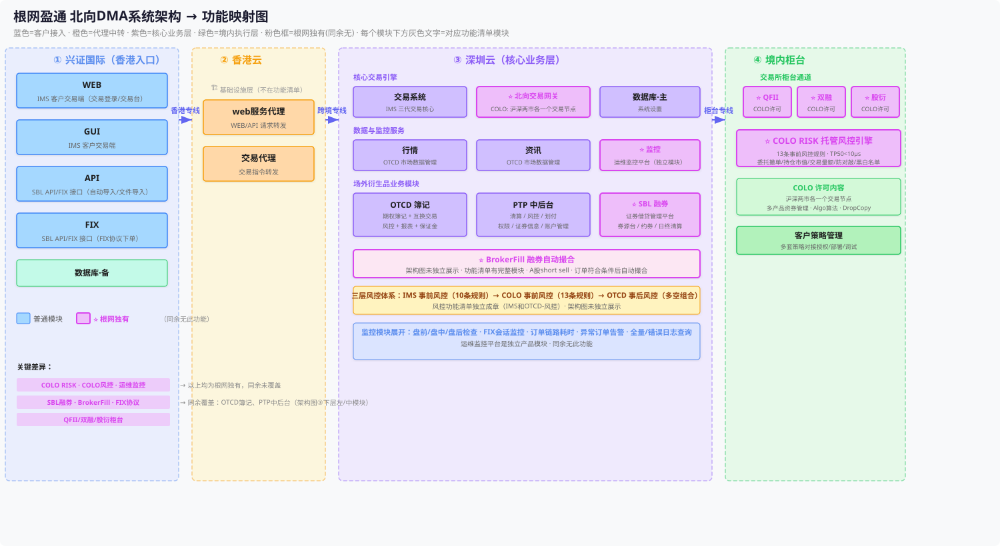

# xywork

兴业证券工作文档 & 架构图

---

## 根网盈通 北向DMA系统架构 → 功能映射图



> 蓝色=客户接入 · 橙色=代理中转 · 紫色=核心业务层 · 绿色=境内执行层 · 粉色框=根网独有(同余无)

### ⭐ 根网独有（同余未覆盖）

- **COLO RISK** — 13条事前风控规则，TP50<10μs
- **COLO 事前风控** — 委托/撤单/持仓/交易量/防对敲/黑白名单
- **运维监控平台** — 盘前/盘中/盘后检查 + FIX日志 + 链路耗时
- **SBL 融券** — 证券借贷管理平台（券源台/约券/日终清算）
- **BrokerFill** — 融券自动撮合
- **QFII/双融/股衍柜台** — COLO许可对接

### 同余覆盖的模块

- OTCD 簿记 ✅
- PTP 中后台 ✅

---

## 授权校验入群流程


> 一个码一个群模式

---

## 文件说明

```
xywork/
├── README.md                              # 本文件
├── genwang-arch-mapping.svg               # 架构图 (SVG, 可直接查看)
├── genwang-arch-mapping.excalidraw        # 架构图源文件 (可编辑)
├── genwang-arch-mapping.html              # 架构图网页版
├── genwang-arch/
│   └── index.html                         # 架构图网页版（GitHub Pages, 内网可访问）
└── auth-flow/
    ├── index.html                         # 授权入群流程图网页版
    └── 授权校验入群流程.png               # 授权入群流程图
```
